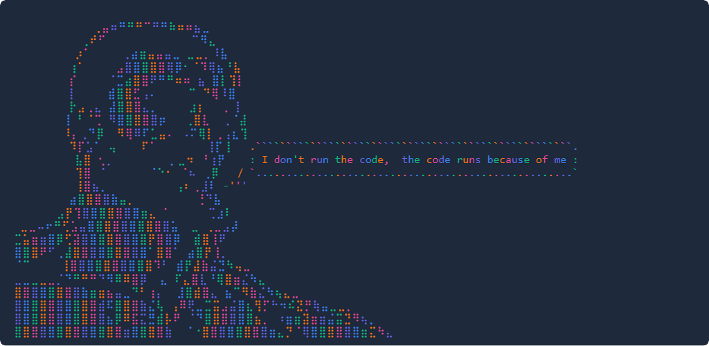

# Chad Say Generator Web

A fun little browser toy to slap your own messages onto epic ASCII “Chads.” No install, no fuss—just open in your browser and start memeing.

---

## 🚀 Try It Out

👉 [Open it live on GitHub Pages](https://maliosdark.github.io/chad-say-generator)

---

## ✨ What’s Inside

- **8 Chad styles** (or hit **Random** for surprises)  
- **Color modes**: default mono, red, blue, green, purple, gradient or random  
- **Multi-line messages**—type anything you want  
- Bubble auto-sizes & sits to the right (and a bit down) of your Chad  
- **Copy** the raw ASCII to clipboard  
- **Download** a PNG of your masterpiece  
- **Share** natively via Web Share API  
- Totally **responsive** and dark-mode by default

---

## 🧰 How to Use

1. Grab the repo (or just click that live link).  
2. Open **index.html** in any modern browser.  
3. Type your message, pick a Chad, pick a color.  
4. Click **Generate** and watch the magic.  
5. Hit **Copy**, **Download**, or **Share**—and spread those Chad vibes.

Just open it up, mess around, and enjoy.

---

## 🪄 About

Built on the OG [chadsay](https://github.com/agvxov/chadsay) CLI tool. Same meme spirit, but with buttons, colors, and browser magic.

Purely for fun—no servers, no libraries (except Tailwind & html2canvas), zero stress.

---

## 👤 Who Made This

**Malios Dark**  
GitHub: [@MaliosDark](https://github.com/MaliosDark)  
Twitter: [@aschittone](https://x.com/aschittone)
